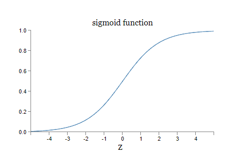

# Sigmoid神经网络

####

#### [Sigmoid neurons](http://neuralnetworksanddeeplearning.com/chap1.html#sigmoid\_neurons)

学习算法听起来很棒。但是我们如何为神经网络设计这样的算法呢？假设我们有一个感知器网络，我们想要用它来学习解决某个问题。

例如，网络的输入可能是来自手写数字扫描图像的原始像素数据。我们希望网络能够学习权重和偏置，以使网络的输出正确地对数字进行分类。为了看看学习是如何工作的，假设我们对网络中的某个权重（或偏置）进行微小的改变。我们希望这个微小的权重变化只引起网络输出的相应小变化。正如我们马上会看到的，这种性质将使学习成为可能。这里是一个示意图（显然，这个网络对手写识别来说太简单了！):

<figure><figcaption></figcaption></figure>

如果一个权重（或偏置）的微小变化导致输出只有微小变化的话，我们可以利用这个事实来修改权重和偏置，使得网络的行为更符合我们的要求。例如，假设网络错误地将一幅图像分类为“8”，而实际上它应该是“9”。我们可以找出如何微调权重和偏置，使得网络更接近将图像分类为“9”。然后我们会不断重复这个过程，一遍又一遍地调整权重和偏置，以产生越来越好的输出。网络将在学习中不断改进。

问题在于当我们的网络包含感知器时，情况并不是这样的。实际上，网络中任何一个感知器的权重或偏置的微小变化有时都会导致该感知器的输出完全翻转，例如从0变成1。这种翻转可能会使网络的其他部分以某种复杂的方式完全改变行为。因此，虽然你的“9”现在可能被正确分类，但网络在所有其他图像上的行为可能已经以某种难以控制的方式完全改变。这使得很难看出如何逐渐修改权重和偏置，使得网络更接近所期望的行为。也许有一些聪明的方法可以解决这个问题。但是我们并不立即明确如何使感知器网络学习。

我们可以通过引入一种名为sigmoid神经元的新类型人工神经元来克服这个问题。Sigmoid神经元与感知器类似，但经过修改，使得它们的权重和偏置的微小变化只会导致输出的微小变化。这是关键的事实，将使得sigmoid神经元网络能够进行学习。

好的，让我描述一下sigmoid神经元。我们将用与描述感知器相同的方式来描绘sigmoid神经元：\

<figure><figcaption></figcaption></figure>

就像感知器一样，sigmoid神经元有输入x1，x2等。但与其只能是0或1不同，这些输入也可以取0到1之间的任何值。例如，0.638...是sigmoid神经元的有效输入。同样，sigmoid神经元也有每个输入的权重w1，w2等，以及一个整体偏置b。但输出不是0或1。而是:

$$
\sigma(w \cdot x+b)
$$

其中σ称为sigmoid函数。顺便提一下，σ有时被称为逻辑函数，而这种新类型的神经元称为逻辑神经元。记住这些术语是有用的，因为许多从事神经网络研究的人使用这些术语。然而，我们将坚持使用sigmoid的术语。sigmoid函数由以下公式定义：

<figure><figcaption></figcaption></figure>

更加明确地说，具有输入x1，x2等，权重w1，w2等和偏置b的sigmoid神经元的输出是：

<figure><figcaption></figcaption></figure>

乍看之下，sigmoid神经元与感知器似乎非常不同。如果您对sigmoid函数的代数形式不熟悉，它可能看起来很晦涩难懂。实际上，感知器和sigmoid神经元之间有许多相似之处，而sigmoid函数的代数形式事实上更多地是一个技术细节，而不是真正的理解障碍。

要理解与感知器模型的相似之处，假设z≡w⋅x+b是一个很大的正数。那么e^(-z)≈0，因此σ(z)≈1。换句话说，当

$$
z
\equiv w \cdot x + b
$$

很大且为正数时，sigmoid神经元的输出近似为1，就像对于感知器一样。另一方面，假设z=w⋅x+b非常负。那么e^(-z)→∞，σ(z)≈0。因此，当z=w⋅x+b非常负时，sigmoid神经元的行为也非常接近感知器。只有当

$$
z = w \cdot x +b
$$

的值适中时，与感知器模型相比才会有很大的偏差。

那么σ的代数形式如何理解呢？实际上，σ的确切形式并不那么重要——真正重要的是在绘图时的函数形状。下面是这个形状：

<figure><figcaption></figcaption></figure>

这个形状是一个平滑的阶跃函数版本：

\

<figure><figcaption></figcaption></figure>

